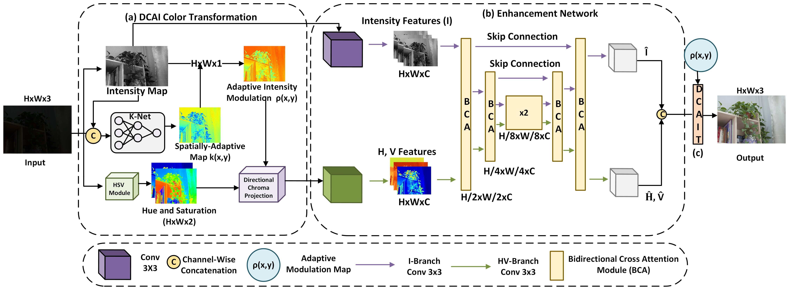
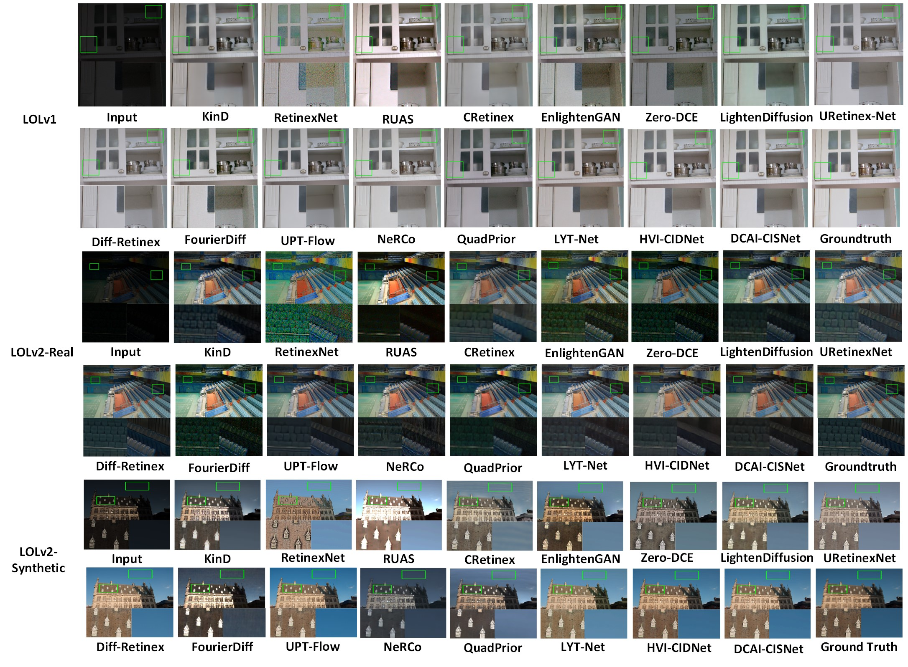
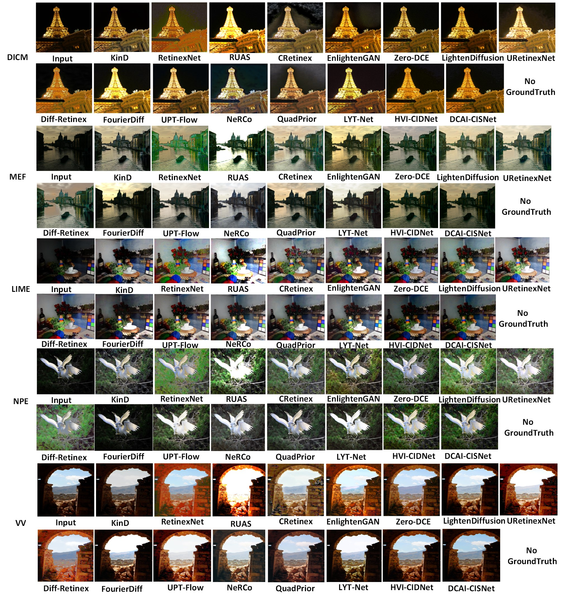

# [ETCC2026] DCAI-CISNet: Directional Chroma–Adaptive Intensity with Chromatic–Illumination Separation Network for Low-Light Image Enhancement

**[Mousumi Behera] (https://scholar.google.com/citations?user=XJnM_dEAAAAJ&hl=en&oi=ao)<sup>∗ </sup>, [Prasenjit Dey] (https://scholar.google.com/citations?user=Z46lTvcAAAAJ&hl=en&oi=ao)

## Pretrained Weights

All the weights that we trained on different datasets is available at [[Google Drive] (https://drive.google.com/drive/folders/1FOxEBY2fm83QLyAHhywGTQULJWh6y32D?usp=sharing)]

## 1. Get Started

### Dependencies and Installation

- Python 3.10
- PyTorch 2.5.1
- TorchVision 0.20.1
- CUDA 12.x
- NumPy 1.26.4

(1) Create Conda Environment

```bash
conda create --name CISNet python=3.10
conda activate CISNet
```
(2) Clone Repo

```bash
git clone https://github.com/mousumibehera821/DCAI-CISNet.git
cd DCAI-CISNet
```
(3) Install Dependencies
```bash
pip install -r requirements.txt
```
### Download the dataset

- [LOLv1] (https://drive.google.com/drive/folders/1vptcAgiR3uCbNNFCLBLlKTS3tX4n57NF?usp=sharing)
- [LOLv2] (https://drive.google.com/drive/folders/1eFQHkII2TfT9Vunt5OgbPDC-wI7i-2KK?usp=sharing)
- [DICM] (https://drive.google.com/drive/folders/1vPCIe043jb6xfgreuxL92iYFX-702aZ8?usp=sharing)
- [MEF] (https://drive.google.com/drive/folders/1rrjQHfKu78LgRl_iWuW35g37zyk5u5kl?usp=sharing)
- [LIME] (https://drive.google.com/drive/folders/1iUks0KLXxlYloYVCli324MvAOxJNUMnu?usp=sharing)
- [NPE] (https://drive.google.com/drive/folders/1B4uz2_Cmfmn_d5xA790J7Qg5Xd6I_Tel?usp=sharing)
- [VV] (https://drive.google.com/drive/folders/1cJFbCbvcN3n6SY2wmsFwkS4HnjeNXDoB?usp=sharing)

## 2. Testing
Download our weights from [[Google Drive] (https://drive.google.com/drive/folders/1FOxEBY2fm83QLyAHhywGTQULJWh6y32D?usp=sharing)]
```
├── weights
    ├── LOLv1.pth
    ├── LOLv2R.pth
    └── LOLv2S.pth
```
# LOLv1
python eval.py --lol

# LOLv2R
python eval.py --lol_v2_real --best_PSNR

# LOLv2S
python eval.py --lol_v2_syn

# DICM
python eval.py --unpaired --DICM

# MEF
python eval.py --unpaired --MEF

# LIME
python eval.py --unpaired --LIME

# NPE
python eval.py --unpaired --NPE

# VV
python eval.py --unpaired --VV

## 3. Training
- We put all the configurations that need to be adjusted in the `./data/options.py` folder.

```bash
# You can choose these dataset for training: lolv1, lolv2real, lolv2syn.
#Below is the example.
python train.py --dataset lol_v1
```
- All weights are saved to the `./weights/train` folder and are saved in steps of the checkpoint set in the `options.py`  as `epoch_*.pth` where `*` represent the epoch number.

## 4. Methodology
Directional Chroma Adaptive Intensity illustration is below:
<details>
<summary><b>DCAI</b></summary>
    
<p align="center">
  
</p>
</details>

<details>
<summary><b>Methodology</b></summary>

The overall architecture of DCAI-CISNet is illustrated below.

<p align="center">
  
</p>
</details>

## 5. Results
### 5.1 Quantitative Results on Paired Datasets
Quantitative comparison on three paired low-light image enhancement datasets: LOLv1, LOLv2-Real, and LOLv2-Synthetic. ↑ indicates higher is better, while ↓ indicates lower is better.

<details>
<summary><b>Paired Datasets: LOLv1, LOLv2-Real, and LOLv2-Synthetic</b></summary>

<br>

<table>
<thead>
<tr>
<th rowspan="2">Methods</th>
<th colspan="4">LOLv1</th>
<th colspan="4">LOLv2-Real</th>
<th colspan="4">LOLv2-Synthetic</th>
</tr>
<tr>
<th>PSNR ↑</th>
<th>SSIM ↑</th>
<th>LPIPS ↓</th>
<th>FID ↓</th>
<th>PSNR ↑</th>
<th>SSIM ↑</th>
<th>LPIPS ↓</th>
<th>FID ↓</th>
<th>PSNR ↑</th>
<th>SSIM ↑</th>
<th>LPIPS ↓</th>
<th>FID ↓</th>
</tr>
</thead>

<tbody>

<tr>
<td>KinD</td>
<td>17.574</td><td>0.686</td><td>0.269</td><td>63.340</td>
<td>21.083</td><td>0.845</td><td>0.099</td><td>56.938</td>
<td>18.319</td><td>0.792</td><td>0.197</td><td>92.394</td>
</tr>

<tr>
<td>RetinexNet</td>
<td>16.774</td><td>0.425</td><td>0.375</td><td>147.468</td>
<td>16.097</td><td>0.407</td><td>0.436</td><td>141.800</td>
<td>17.136</td><td>0.756</td><td>0.203</td><td>95.552</td>
</tr>

<tr>
<td>RUAS</td>
<td>16.404</td><td>0.503</td><td>0.193</td><td>102.091</td>
<td>15.325</td><td>0.493</td><td>0.216</td><td>93.694</td>
<td>13.404</td><td>0.640</td><td>0.282</td><td>123.665</td>
</tr>

<tr>
<td>C-Retinex</td>
<td>19.866</td><td>0.803</td><td>0.137</td><td>81.317</td>
<td>20.371</td><td>0.833</td><td>0.141</td><td>73.065</td>
<td>17.415</td><td>0.812</td><td>0.161</td><td>76.622</td>
</tr>

<tr>
<td>EnlightenGAN</td>
<td>12.590</td><td>0.414</td><td>0.324</td><td>109.317</td>
<td>14.131</td><td>0.428</td><td>0.284</td><td>95.914</td>
<td>16.572</td><td>0.771</td><td>0.169</td><td>73.480</td>
</tr>

<tr>
<td>Zero-DCE</td>
<td>14.860</td><td>0.562</td><td>0.236</td><td>87.275</td>
<td>18.058</td><td>0.579</td><td>0.215</td><td>79.307</td>
<td>17.756</td><td>0.814</td><td>0.126</td><td>49.077</td>
</tr>

<tr>
<td>LightenDiffusion</td>
<td>20.107</td><td>0.808</td><td>0.122</td><td>83.416</td>
<td>22.777</td><td>0.852</td><td>0.104</td><td>75.164</td>
<td>21.386</td><td>0.867</td><td>0.119</td><td>55.130</td>
</tr>

<tr>
<td>URetinex-Net</td>
<td>18.423</td><td>0.694</td><td>0.240</td><td>55.618</td>
<td>21.221</td><td><u>0.859</u></td><td>0.090</td><td>50.120</td>
<td>10.082</td><td>0.249</td><td>0.679</td><td>289.256</td>
</tr>

<tr>
<td>Diff-Retinex</td>
<td>21.980</td><td>0.841</td><td><u>0.065</u></td><td>51.875</td>
<td>20.170</td><td>0.826</td><td>0.093</td><td>56.295</td>
<td>24.301</td><td>0.921</td><td>0.193</td><td>92.727</td>
</tr>

<tr>
<td>FourierDiff</td>
<td>17.563</td><td>0.612</td><td>0.204</td><td>77.764</td>
<td>16.859</td><td>0.607</td><td>0.217</td><td>70.662</td>
<td>14.198</td><td>0.650</td><td>0.231</td><td>77.903</td>
</tr>

<tr>
<td>UPT-Flow</td>
<td>20.667</td><td>0.835</td><td>0.077</td><td><u>49.611</u></td>
<td>22.060</td><td>0.850</td><td><u>0.085</u></td><td><u>49.627</u></td>
<td><u>25.243</u></td><td><u>0.936</u></td><td><u>0.035</u></td><td>19.863</td>
</tr>

<tr>
<td>NeRCo</td>
<td>19.411</td><td>0.656</td><td>0.258</td><td>77.431</td>
<td>22.172</td><td>0.786</td><td>0.108</td><td>84.535</td>
<td>16.065</td><td>0.673</td><td>0.270</td><td>127.721</td>
</tr>

<tr>
<td>QuadPrior</td>
<td>18.788</td><td>0.776</td><td>0.134</td><td>74.977</td>
<td>20.472</td><td>0.807</td><td>0.130</td><td>65.564</td>
<td>16.105</td><td>0.753</td><td>0.201</td><td>75.621</td>
</tr>

<tr>
<td>LYT-Net</td>
<td>22.381</td><td>0.826</td><td>0.591</td><td>60.879</td>
<td>21.830</td><td>0.849</td><td>0.536</td><td>51.369</td>
<td>23.780</td><td>0.921</td><td>0.610</td><td>35.998</td>
</tr>

<tr>
<td>HVI-CIDNet</td>
<td><u>22.590</u></td><td><u>0.844</u></td><td>0.072</td><td>50.687</td>
<td><u>22.805</u></td><td>0.854</td><td>0.104</td><td>60.716</td>
<td>25.167</td><td>0.933</td><td>0.036</td><td><u>18.800</u></td>
</tr>

<tr>
<td><strong>DCAI-CISNet (Ours)</strong></td>
<td><strong>23.114</strong></td>
<td><strong>0.850</strong></td>
<td><strong>0.064</strong></td>
<td><strong>48.850</strong></td>
<td><strong>23.537</strong></td>
<td><strong>0.868</strong></td>
<td><strong>0.084</strong></td>
<td><strong>49.594</strong></td>
<td><strong>25.371</strong></td>
<td><strong>0.936</strong></td>
<td><strong>0.035</strong></td>
<td><strong>17.935</strong></td>
</tr>

</tbody>
</table>
</details>

### 5.2 Quantitative Results on Unpaired Datasets
Quantitative evaluation on five unpaired datasets: DICM, MEF, LIME, NPE, and VV. Lower values indicate better performance for all three metrics.

<details>
<summary><b>Unpaired Datasets: DICM, MEF, LIME, NPE, and VV</b></summary>

<br>


<table>
<thead>
<tr>
<th rowspan="2">Methods</th>
<th colspan="3">DICM</th>
<th colspan="3">MEF</th>
<th colspan="3">LIME</th>
<th colspan="3">NPE</th>
<th colspan="3">VV</th>
</tr>
<tr>
<th>NIQE ↓</th>
<th>BRISQUE ↓</th>
<th>PI ↓</th>
<th>NIQE ↓</th>
<th>BRISQUE ↓</th>
<th>PI ↓</th>
<th>NIQE ↓</th>
<th>BRISQUE ↓</th>
<th>PI ↓</th>
<th>NIQE ↓</th>
<th>BRISQUE ↓</th>
<th>PI ↓</th>
<th>NIQE ↓</th>
<th>BRISQUE ↓</th>
<th>PI ↓</th>
</tr>
</thead>

<tbody>

<tr>
<td>KinD</td>
<td>4.432</td><td>32.476</td><td>17.454</td>
<td>3.350</td><td>32.018</td><td>17.634</td>
<td>3.765</td><td>40.100</td><td>21.583</td>
<td>5.224</td><td>20.202</td><td>12.710</td>
<td>5.767</td><td>32.383</td><td>17.075</td>
</tr>

<tr>
<td>RetinexNet</td>
<td>4.899</td><td>30.362</td><td>17.630</td>
<td>5.828</td><td>20.886</td><td>13.357</td>
<td>13.232</td><td>31.923</td><td>22.577</td>
<td>6.162</td><td>16.796</td><td>11.579</td>
<td>3.293</td><td>29.625</td><td>16.459</td>
</tr>

<tr>
<td>RUAS</td>
<td>6.938</td><td>55.426</td><td>28.182</td>
<td><strong>1.064</strong></td><td>34.568</td><td>17.816</td>
<td>6.225</td><td>35.020</td><td>20.622</td>
<td><strong>0.476</strong></td><td>71.194</td><td>35.835</td>
<td><strong>0.487</strong></td><td>61.573</td><td>31.030</td>
</tr>

<tr>
<td>C-Retinex</td>
<td><strong>1.980</strong></td><td>33.017</td><td>17.499</td>
<td>5.781</td><td>31.148</td><td>16.964</td>
<td>3.751</td><td>29.761</td><td>16.706</td>
<td>5.802</td><td>33.688</td><td>17.099</td>
<td>2.039</td><td>32.040</td><td>17.039</td>
</tr>

<tr>
<td>EnlightenGAN</td>
<td>3.877</td><td><strong>21.509</strong></td><td>15.443</td>
<td>4.525</td><td>15.341</td><td>9.933</td>
<td>4.693</td><td>17.246</td><td>10.969</td>
<td><u>3.920</u></td><td>17.906</td><td>10.508</td>
<td>2.000</td><td>39.577</td><td>20.788</td>
</tr>

<tr>
<td>Zero-DCE</td>
<td>3.858</td><td>27.135</td><td>15.298</td>
<td>4.730</td><td>17.321</td><td>11.025</td>
<td>7.390</td><td>21.744</td><td>14.567</td>
<td>5.219</td><td>21.355</td><td>13.287</td>
<td>2.559</td><td>34.414</td><td>18.487</td>
</tr>

<tr>
<td>LightenDiffusion</td>
<td>3.777</td><td>25.744</td><td>14.610</td>
<td>4.904</td><td>19.824</td><td>12.364</td>
<td>6.435</td><td>16.697</td><td>11.566</td>
<td>6.789</td><td>17.604</td><td>10.696</td>
<td>2.351</td><td>26.046</td><td>15.699</td>
</tr>

<tr>
<td>URetinex-Net</td>
<td>3.845</td><td>26.747</td><td><u>14.396</u></td>
<td>3.649</td><td>19.602</td><td>11.626</td>
<td>6.466</td><td>23.202</td><td>14.834</td>
<td>4.250</td><td><strong>14.396</strong></td><td>19.323</td>
<td><u>1.570</u></td><td>33.669</td><td>17.619</td>
</tr>

<tr>
<td>Diff-Retinex</td>
<td>4.409</td><td>25.974</td><td>15.692</td>
<td><u>3.164</u></td><td>23.456</td><td>13.310</td>
<td>3.839</td><td>20.875</td><td>12.157</td>
<td>5.755</td><td>18.228</td><td>11.992</td>
<td>2.425</td><td>26.051</td><td>15.738</td>
</tr>

<tr>
<td>FourierDiff</td>
<td>3.789</td><td>27.994</td><td>15.892</td>
<td>3.797</td><td>19.769</td><td>11.783</td>
<td>4.163</td><td>17.203</td><td>10.683</td>
<td>4.323</td><td>17.294</td><td><u>10.409</u></td>
<td>4.057</td><td>31.538</td><td>17.797</td>
</tr>

<tr>
<td>UPT-Flow</td>
<td>4.004</td><td>26.252</td><td>15.128</td>
<td>4.103</td><td>24.626</td><td>14.365</td>
<td>5.686</td><td>27.681</td><td>16.684</td>
<td>4.395</td><td>20.565</td><td>12.480</td>
<td>4.212</td><td>29.419</td><td>16.815</td>
</tr>

<tr>
<td>NeRCo</td>
<td>4.055</td><td>26.311</td><td>14.683</td>
<td>3.834</td><td>17.622</td><td>10.728</td>
<td>3.895</td><td>20.826</td><td>12.360</td>
<td>4.440</td><td>20.653</td><td>12.547</td>
<td>3.886</td><td>27.588</td><td>14.837</td>
</tr>

<tr>
<td>QuadPrior</td>
<td>3.667</td><td>25.003</td><td>19.335</td>
<td>3.398</td><td>17.937</td><td>10.567</td>
<td>3.936</td><td><u>15.107</u></td><td><strong>9.022</strong></td>
<td>5.102</td><td>21.179</td><td>12.141</td>
<td>2.948</td><td><strong>14.252</strong></td><td><strong>8.600</strong></td>
</tr>

<tr>
<td>LYT-Net</td>
<td>4.691</td><td>25.057</td><td>14.874</td>
<td>4.770</td><td>31.042</td><td>17.906</td>
<td>4.637</td><td>28.618</td><td>16.628</td>
<td>5.210</td><td>29.307</td><td>17.259</td>
<td>4.309</td><td>32.275</td><td>18.292</td>
</tr>

<tr>
<td>HVI-CIDNet</td>
<td>3.788</td><td>24.538</td><td>14.798</td>
<td>3.308</td><td><u>12.716</u></td><td><u>7.212</u></td>
<td><u>3.688</u></td><td>15.994</td><td>10.811</td>
<td>4.229</td><td>16.874</td><td>10.451</td>
<td>3.635</td><td>27.051</td><td>15.343</td>
</tr>

<tr>
<td><strong>DCAI-CISNet (Ours)</strong></td>
<td><u>3.610</u></td>
<td><u>24.383</u></td>
<td><strong>13.996</strong></td>
<td>3.296</td>
<td><strong>11.012</strong></td>
<td><strong>7.154</strong></td>
<td><strong>3.663</strong></td>
<td><strong>14.884</strong></td>
<td><u>9.273</u></td>
<td>4.132</td>
<td><u>16.630</u></td>
<td><strong>10.381</strong></td>
<td>3.619</td>
<td><u>25.863</u></td>
<td><u>14.741</u></td>
</tr>

</tbody>
</table>
</details>

### 5.3 Qualitative Results on Paired Dataset
Qualitative comparisons of DCAI-CISNet with representative low-light image enhancement methods are presented below.

<details>
<summary><b>paired</b></summary>

<p align="center">
  
</p>

</details>

### 5.4 Qualitative Results on Unpaired Dataset
Qualitative comparisons of DCAI-CISNet with representative low-light image enhancement methods are presented below.
<details>
<summary><b>unpaired</b></summary>

<p align="center">
  
</p>

</details>
    
## 6. Contact

- If you have any questions, please feel free to contact us or submit an issue to the repository!
    Mousumi Behera (mousumibehera821@gmail.com or 524cs3009@nitrkl.ac.in)

## 7. Citation
If you find our proposed work useful for your research, please cite our paper:

```bibtex
@inproceedings{Behera2026DCAICISNet,
  author    = {Mousumi Behera and Prasenjit Dey},
  title     = {DCAI-CISNet: Directional Chroma-Adaptive Intensity with Chromatic-Illumination Separation Network for Low-Light Image Enhancement},
  booktitle = {2026 International Conference on Emerging Technologies in Computing and Communication (ETCC)},
  year      = {2026},
  pages     = {1--6},
  doi       = {10.1109/ETCC69750.2026.11681954}
}
